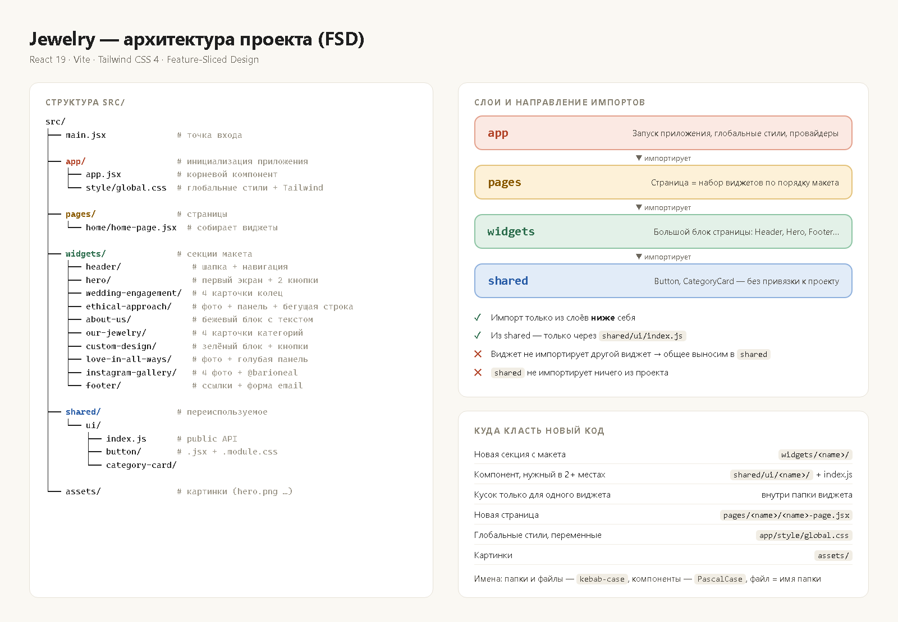

# Jewelry — лендинг ювелирного магазина

Учебный проект на **React 19 + Vite + Tailwind CSS 4**.
Архитектура — **FSD (Feature-Sliced Design)**, упрощённая под лендинг.

---

## Быстрый старт

```bash
npm install      # поставить зависимости (один раз после клона)
npm run dev      # запустить dev-сервер → http://localhost:5173
npm run build    # собрать прод-версию в папку dist/
npm run lint     # проверить код ESLint'ом (запускай перед пушем)
```

---

## Структура проекта



```
Jewelry/
├── public/                     # Статика, отдаётся как есть (favicon, иконки)
├── index.html                  # HTML-шаблон, сюда монтируется React (#root)
├── vite.config.js              # Конфиг Vite (плагины React + Tailwind)
├── eslint.config.js            # Правила линтера
│
└── src/
    ├── main.jsx                # Точка входа: рендерит <App /> и подключает global.css
    │
    ├── app/                    # 🔝 Слой APP — инициализация всего приложения
    │   ├── app.jsx             #    Корневой компонент, сейчас просто рендерит HomePage
    │   └── style/
    │       └── global.css      #    Глобальные стили + подключение Tailwind
    │
    ├── pages/                  # 📄 Слой PAGES — целые страницы
    │   └── home/
    │       └── home-page.jsx   #    Главная: собирает виджеты сверху вниз
    │
    ├── widgets/                # 🧩 Слой WIDGETS — большие самостоятельные блоки страницы
    │   ├── header/             #    Шапка: "Read our Customer Reviews" + навигация
    │   ├── hero/               #    Первый экран: "We Find Always in All Ways" + 2 кнопки
    │   ├── wedding-engagement/ #    4 карточки: Cluster Rings, Bands, Rings, Custom Design
    │   ├── ethical-approach/   #    Картинка + зелёная панель + бегущая строка
    │   ├── about-us/           #    Бежевый блок с большим текстом
    │   ├── our-jewelry/        #    4 карточки: Rings, Bracelets, Necklaces, Earrings
    │   ├── custom-design/      #    Зелёный блок + 2 кнопки + бегущая строка "Blog"
    │   ├── love-in-all-ways/   #    Картинка + голубая панель + "Learn More"
    │   ├── instagram-gallery/  #    4 фото + @barioneal
    │   └── footer/             #    Колонки ссылок + форма email
    │
    ├── shared/                 # 🧱 Слой SHARED — переиспользуемые "кирпичики"
    │   └── ui/
    │       ├── index.js        #    Public API: всё из shared/ui экспортируется отсюда
    │       ├── button/         #    Кнопка/ссылка-кнопка (варианты light, outline)
    │       └── category-card/  #    Карточка: картинка + подпись
    │
    └── assets/                 # Картинки, которые импортируются в код (hero.png и т.д.)
```

> Порядок виджетов в `home-page.jsx` = порядок блоков на макете сверху вниз.

---

## Что такое FSD и как тут всё устроено

Код делится на **слои**. Каждый слой — это уровень "ответственности".
Чем выше слой, тем он "конкретнее"; чем ниже — тем "универсальнее".

```
   app        ← собирает всё приложение (провайдеры, глобальные стили, роутинг)
    ↓
   pages      ← страница = набор виджетов
    ↓
   widgets    ← большой блок страницы (секция макета)
    ↓
   shared     ← мелкие универсальные детали (кнопки, карточки, утилиты)
```

### 🚦 Главное правило импортов

**Слой может импортировать только из слоёв НИЖЕ себя.**

| Откуда (слой)   | Можно импортировать из          | Нельзя                        |
|-----------------|---------------------------------|-------------------------------|
| `app`           | `pages`, `widgets`, `shared`    | —                             |
| `pages`         | `widgets`, `shared`             | `app`                         |
| `widgets`       | `shared`                        | `app`, `pages`, другой виджет |
| `shared`        | только внешние библиотеки       | всё остальное                 |

Важно:
- **Виджет не импортирует другой виджет.** Если двум виджетам нужен один и тот же кусок — выносим его в `shared/ui`.
- **`shared` ничего не знает о проекте.** Там не должно быть текстов "Bario Neal", конкретных картинок и т.п. — только компоненты, которые получают всё через props.

```jsx
// ✅ Правильно — виджет берёт кнопку из shared
import { Button } from '../../shared/ui'

// ❌ Неправильно — виджет лезет в другой виджет
import Hero from '../hero/hero'

// ❌ Неправильно — shared лезет наверх
import Header from '../../widgets/header/header'
```

---

## Куда класть новый код — шпаргалка

| Что делаю                                         | Куда кладу                          |
|---------------------------------------------------|-------------------------------------|
| Новую секцию с макета (целый блок)                | `src/widgets/<имя-секции>/`         |
| Кнопку, инпут, карточку, бегущую строку и т.п., которые нужны в 2+ местах | `src/shared/ui/<имя>/` + экспорт в `shared/ui/index.js` |
| Маленький кусок, который нужен только одному виджету | внутрь папки этого виджета        |
| Новую страницу (например, `/about`)               | `src/pages/<имя>/<имя>-page.jsx`    |
| Глобальные стили, шрифты, CSS-переменные          | `src/app/style/global.css`          |
| Картинки для компонентов                          | `src/assets/`                       |
| Файлы, которые не импортируются (favicon)         | `public/`                           |

**Кандидаты в `shared/ui`** (по макету повторяются в нескольких секциях):
`Marquee` (бегущая строка — в Ethical Approach и Custom Design), `SectionTitle`, `Input` (форма в футере).

---

## Как устроен один слайс (папка компонента)

```
widgets/hero/
├── hero.jsx            # сам компонент (export default)
└── hero.module.css     # стили (если нужны CSS-модули)
```

```
shared/ui/button/
├── button.jsx
└── button.module.css
```

Когда в `shared/ui` появляется новый компонент — **обязательно** добавь его в `shared/ui/index.js`:

```js
export { default as Button } from './button/button'
export { default as CategoryCard } from './category-card/category-card'
export { default as Marquee } from './marquee/marquee'   // ← новый
```

И импортируй всегда через index, а не напрямую в файл:

```jsx
import { Button, CategoryCard } from '../../shared/ui'   // ✅
import Button from '../../shared/ui/button/button'        // ❌
```

---

## Соглашения по коду

**Именование**
- Папки и файлы — `kebab-case`: `wedding-engagement/wedding-engagement.jsx`
- Компоненты — `PascalCase`: `WeddingEngagement`
- Имя файла = имя папки: `button/button.jsx`, `button/button.module.css`
- Страницы с суффиксом `-page`: `home-page.jsx` → `HomePage`

**Компоненты**
- Один компонент = один файл, `export default function Name()`.
- Корень виджета — `<section>`, в начале файла комментарий, что это за блок по макету.
- Тексты, картинки, ссылки в виджете можно держать массивом в начале файла и рендерить через `.map()` (так проще править карточки).

**Стили**
- В проекте подключены и **Tailwind**, и **CSS-модули**. Договорённость:
  - `shared/ui` — CSS-модули (`*.module.css`), импорт как `import s from './x.module.css'`
  - виджеты — Tailwind-классы или CSS-модули, но **в одном виджете не смешиваем** оба подхода.
- Цвета/шрифты, которые повторяются (бежевый, зелёный, голубой с макета), выносим в CSS-переменные в `global.css`.

**Отступы** — табы (как в существующих файлах).

---

## Как добавить новый виджет — пошагово

1. Создай папку `src/widgets/my-block/` и файл `my-block.jsx`:
   ```jsx
   // My Block — краткое описание блока по макету
   import { Button } from '../../shared/ui'

   export default function MyBlock() {
   	return (
   		<section className="my-block">
   			<h2>My Block</h2>
   			<Button variant="outline">Learn More</Button>
   		</section>
   	)
   }
   ```
2. Импортируй его в `src/pages/home/home-page.jsx` и поставь в нужное место внутри `<main>`.
3. `npm run dev` — проверь в браузере.
4. `npm run lint` — без ошибок.

---

## Работа в команде (git)

1. Перед началом: `git pull` на `main`.
2. Каждый виджет — в своей ветке: `git checkout -b widget/hero`.
3. Трогай **только свою папку** в `widgets/`. Если нужно поменять что-то в `shared/` или `home-page.jsx` — предупреди команду, это общие файлы.
4. Коммиты понятные: `hero: add layout and buttons`, `shared/ui: add Marquee`.
5. Перед пушем — `npm run lint`.
6. Пуш + Pull Request в `main`, кто-то из команды смотрит и мёрджит.
